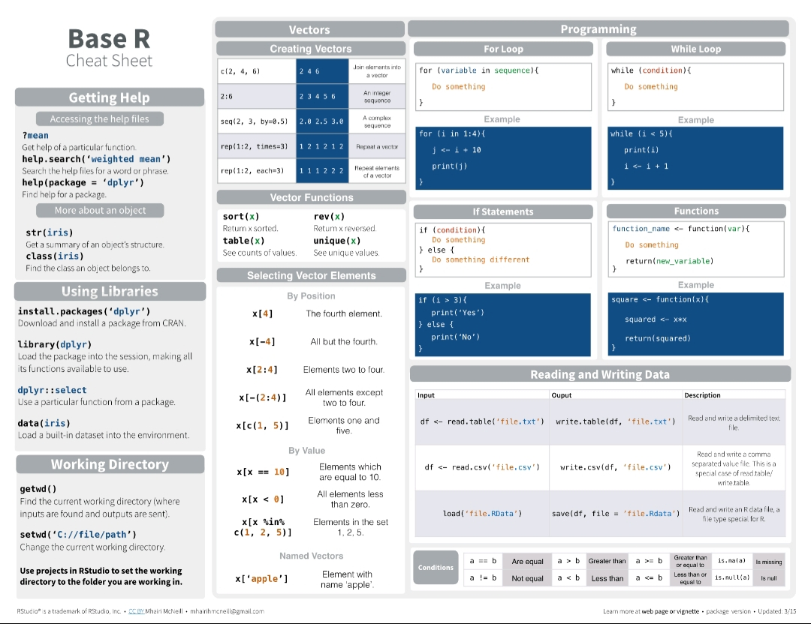
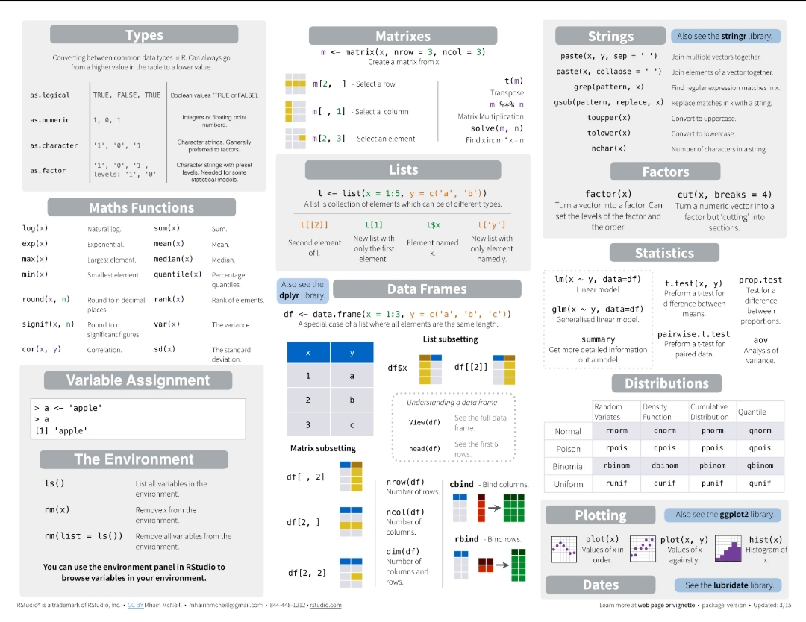

# R-Coding

## Work with R:

- `sudo apt-get update`
- install r base: `sudo apt-get install r-base`
- Go to that link and download it : https://rstudio.com/products/rstudio/download/#download
- install package: `sudo dpkg -i rstudio-1.3.1093-amd64.deb`
- install dependences: `sudo apt-get -f install`

It includes coding of various algorithms and examples,tricks with R programming language. 
*In the study named DecisionTree1.R, one of the data mining classification algorithms, the decision tree and the Wine-Quality data set were used.

 
 
